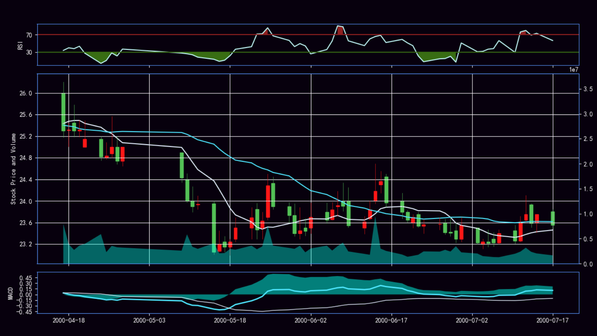

# 组员信息  
## 组长  
胡存浩-U201811633  
## 组员  
胡至祎-U201811631  
梅畅-U201811635  
董佳鑫-U201811660  

# 分工
董佳鑫：利用模型建立交易策略并回测、建模所用数据的可视化分析
胡至祎：完成神经网络股票数据模型的建立、建模所用数据的可视化分析
胡存浩：
梅畅：

# 代码基本介绍与运行方式
## 利用神经网络建模进行股票的预测
### 利用神经网络建立股票预测模型(predictionTest.py)
使用akshare这个模块获取2018.7.1之前的数据用于建立模型，但是akshare获得的数据是该支股票上市以来至今的数据，而我们预测股票数据的范围是2018.7.1-2020.7.1，因此，我们使用drop函数和添加索引的方法获得了1999-2017年的股票数据，使用print()函数将数据输出，可以看到，我们得到的数据在时间上是符合建模要求的。 

接下来，我们使用已经完成定义的build_model()函数建立一个基于神经网络的模型，build_model()函数是一个用于预测未来股票数据的函数，建立好模型后，我们开始对模型进行训练。数据从输入开始，通过定义好的函数，依次进行各节点定义的运算，一直运算到输出。用已有的1999年-2017年的数据，通过不断的优化确定模型（函数）的参数，参数确定后的模型（函数）得到训练的结果。得到模型后，我们使用numpy对模型进行检验。模型建立完成后，我们使用该模型进行股票数据的预测，得到的结果储存在model之中，便于以后进行调用。

### 对建立基于神经网络的股票数据模型进行可视化分析(plot_summary_BigMoney.py)
按照建立基于神经网络的股票模型中获取数据的方式，我们使用to_csv()函数，利用日期建立索引，将获得的dataframe格式的数据输出为data.csv以便于后续操作中对数据进行读取。定义一个date_to_num()函数，用于将数据类型进行转化，从而将数据汇入plot_mat中。

利用plot_mat中有关收盘价的数据，将每10天收盘价的均值和每30天收盘价的均值计算出来，并分别储存在mov_avg_ten和mov_avg_thirty中。之后，再次利用plot_mat中的数据计算收益，将计算得到的结果储存在Volume中。定义cal_rsi()函数、cal_ema()函数、cal_macd()函数，并利用plot_mat中的数据计算rsi、ema和macd以便于绘制rsi蓝白线图、macd图。

利用已经整理好的数据和计算出来的结果，绘制出拥有k线图、rsi蓝白线图和macd图的汇总图。将图中3次出现的横坐标调整为1次，即可得到修正后的汇总图。
汇总图

### 利用模型写出交易策略并回测（tfModelBackTest.py）
首先定义了调用模型预测未来N天收盘价的函数，在主策略程序中调用该函数获得预测的未来一天的收盘价。添加移动均线指标后，调用函数可以获得20日均线。按照股市经验，当预测出未来一天收盘价超过20日均线时，则买入1000股，当预测出未来一天收盘价跌破20日均线时，则卖出1000股。

写出策略后，加载模型，初始化主策略程序，并且通过akshare获取sh600000的后复权数据用于回测，回测系统设置交易手续费为0.2%。

用该交易策略对2018.7.1至2020.7.1回测，初始资金为1000000，收益为12632元。

